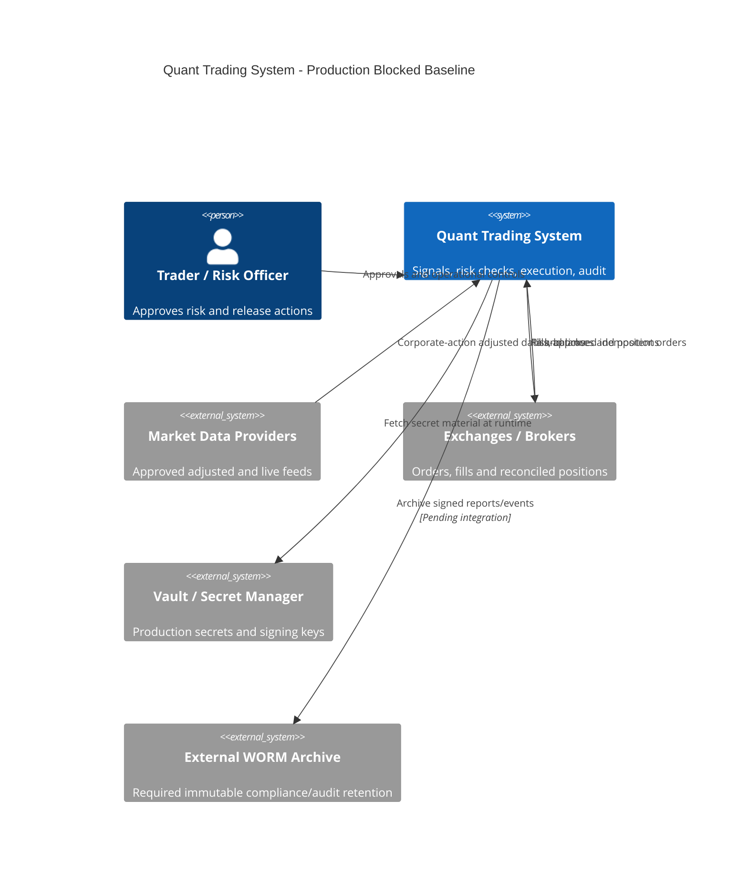
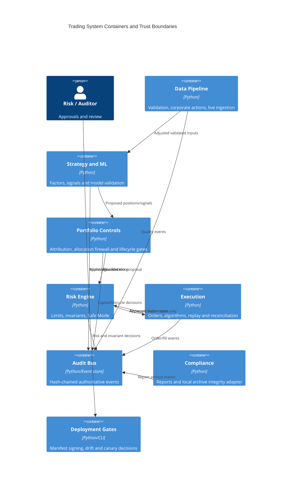
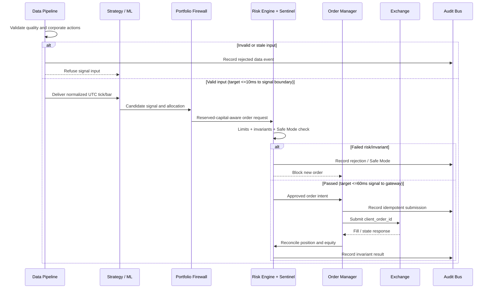

# Quant Trading System Architecture

| Field | Value |
| --- | --- |
| Document version | 2.13.0-baseline |
| Updated | 2026-05-25 |
| Status | Production blocked pending release evidence and approvals |
| Authority | `AGENTS.md`, `feature_list.json`, approved configuration and audit events |

## Version History

| Version | Date | Author | Change |
| --- | --- | --- | --- |
| 2.13.0-baseline | 2026-05-25 | Codex | Establish architecture, NFR, data-flow and gate baseline without asserting production approval |

This document records the safety architecture implemented in the repository and the validation still required. It is not an authorization to trade. A feature may only be released when its capital-impact assessment, risk approval, signed artifact and required validation evidence have been archived.

## Release Posture

- `feature_list.json` intentionally has no `passes=true` entries as of 2026-05-25.
- The current verified local baseline is `579` passing tests at `84.79%` source coverage, with Ruff, Black and strict mypy passing.
- Production trading remains prohibited until paper-trading, small-live, approval, external archival, secrets and deployment gates are completed.
- The core design rule is funds safety before strategy return and development speed.

## Context

## Containers

## Core Flow

## Component Contracts

| Producer | Consumer | Contract | Failure posture |
| --- | --- | --- | --- |
| Data validation | Strategy/backtest/live | Corporate-action adjusted, timestamp-normalized data | Refuse execution and audit anomaly |
| Factor store | Strategy/model | Versioned factor identity plus offline/online snapshot parity hash | Refuse unadjusted or mismatching data |
| Strategy/ML | Portfolio | Candidate signal only; no direct order emission | Model promotion and drift gates block activation |
| Portfolio firewall | Risk engine | Allocation includes pending-order reservations | Reject excess allocation or isolate strategy |
| Risk engine | Order manager | Order allowed only when system is `RUNNING` and limits hold | Enter Safe Mode and prohibit new trades |
| Order manager | Exchange gateway | Unique `client_order_id`, idempotent handling | Return original order on duplicate |
| Reconciler | State machine | Exchange positions/balances compared to internal state | Safe Mode on unacceptable divergence |
| All components | Audit bus | Hash-chained structured event is authoritative | Integrity failure blocks release |
| Compliance | Archive adapter | Template-derived export plus hash-chain verification | External WORM remains required for production |
| Deployment | Runtime | Signed manifest, config drift decision, canary gate | Failed verification blocks rollout |
| Configuration loader | Runtime | Strict validated fields, environment-scoped accounts, production `secret_ref` resolution and approval reference | Production startup fails closed without resolver/approval |

## Invariants

The following invariants are mandatory at execution, reconciliation, recovery and shutdown boundaries:

| Invariant | Definition | Current enforcement surface |
| --- | --- | --- |
| Position | `internal_position + pending_orders == exchange_position`, tolerance `0.01%` | `core/state_machine.py`, `execution/reconciler.py` |
| Equity | `realized_pnl + unrealized_pnl + cash == total_equity` | `core/state_machine.py` and risk paths |
| Order idempotency | One exchange order per `client_order_id` | `execution/order_manager.py` |
| Data consistency | Same corporate-action adjusted basis in research and execution | data/factor parity checks |
| Risk limit | Portfolio VaR(95%) below configured maximum | `risk/engine.py` |

Any detected violation requires a recorded transition to Safe Mode or Emergency mode and prohibits new opening trades.

## Non-Functional Requirements

These are target requirements, not yet production benchmark evidence.

| Requirement | Target | Current evidence | Release status |
| --- | --- | --- | --- |
| Market data to strategy P99 | `<= 10 ms` | Fast-path implementation exists; production benchmark pending | Blocked |
| Signal to gateway P99 | `<= 60 ms` | Execution paths tested; production load benchmark pending | Blocked |
| Availability | `>= 99.9%` | Local disaster/failover tests only | Blocked |
| Recovery time objective | `<= 2 hours` | Local recovery tests only | Blocked |
| Recovery point objective | `<= 1 hour` | Local backup manifest tests only | Blocked |
| Test coverage | Core modules `>= 80%` | `84.79%`, `579` tests passed locally on 2026-05-25; Ruff/Black/mypy clean | Met locally |

## Capacity Planning

Capacity values must be measured under approved datasets and infrastructure before being placed in this table. Supplying guessed TPS or failover capacity would be unsafe.

| Benchmark | Required measurement | Result | Status |
| --- | --- | --- | --- |
| Maximum symbols per node | Validated data-to-order load run | Not measured | Blocked |
| Maximum strategies per node | Concurrent risk and signal processing run | Not measured | Blocked |
| Maximum sustainable order TPS | P99 gateway latency under load | Not measured | Blocked |
| CPU/memory/network baseline | Resource monitor output during benchmark | Not measured | Blocked |
| Multi-region failover RTO/RPO | Controlled failover with invariant reconciliation | Not measured | Blocked |

## Deployment Gates

1. Validate adjusted input data and run deterministic backtest and smoke/regression suites.
2. Generate capital-impact assessment and obtain risk approval for core business changes.
3. Verify configuration drift exceptions and signed manifest/code artifacts.
4. Archive evidence using an approved immutable retention service.
5. Complete paper trading for at least 3 months.
6. Complete approved small-live operation with no breached gates before full-live review.
7. Use canary progression only after prior gates pass; rollback on configured threshold breach.

## Change Impact Matrix

| Changed area | Mandatory dependent verification |
| --- | --- |
| Data / corporate actions | Backtest/live parity, factor hashes, strategy inputs, compliance reports |
| Strategy or ML | Model signature, drift/robustness, paper gate, capital impact, risk limits |
| Portfolio allocation | Reservations, VaR compression, execution quantities, reconciliation |
| Risk thresholds | Order rejection, Safe Mode, alerts, capital-impact approval |
| Execution / orders | Idempotency, stale order handling, reconciliation, replay |
| Audit / compliance | Integrity chain, access controls, retention/archive integration |
| Configuration / deployment | Drift report, manifest signature, canary rollback, recovery |

## Known Production Blockers

- Approved external WORM/audit retention service is not integrated.
- CI/CD does not yet enforce every signed artifact, config drift and capital-approval gate.
- Production configuration now fails closed unless secret and approval validators are injected; real secret-manager/approval services, benchmark/feed adapters, model/factor registry and dashboard integrations still need approved environments.
- Capacity, latency and multi-region recovery targets have not been measured on production-like infrastructure.
- Paper and small-live acceptance durations have not been completed.
